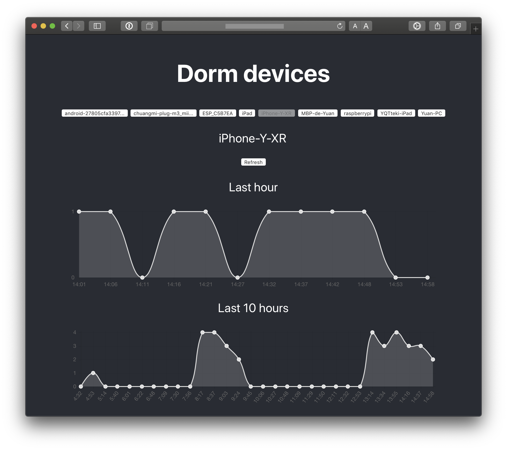

# Lan-neighbors

Lan-neighbors displays the devices on your local network and log their online status. It uses Selenium to get the devices' information from the router's admin page.

Note: You may have to modify the `find_neightbors()` function in `flask/neighbors.py` since I've written it specially for my FAST-FWR200 router. Luckily, some router manufacturers just use the same UI systems.

## Installation

First, install [Selenium with Python](https://selenium-python.readthedocs.io/installation.html).

Then install python and nodejs dependencies:

    pip3 install flask
    
    npm i 
    
    npm run build
    
    
Now you will be able to run the app and view the results on: http://localhost:5000.

    cd flask && python3 app.py

## Screenshot

